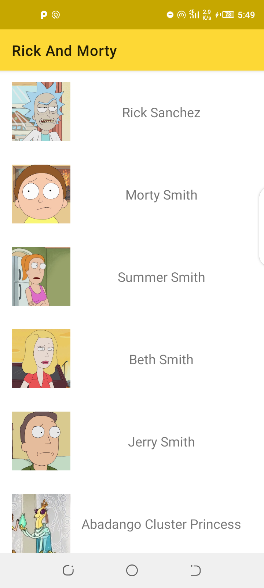
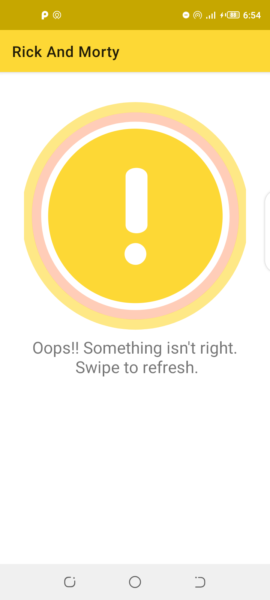

## Rick And Morty - GraphQL Sample App

A sample Graphql client application working with the [Rick And Morty Api](https://rickandmortyapi.com/documentation/).

This is my playground for working with graphql on Android.

## Demo

  

## Libraries

- [Apollo-Android](https://github.com/apollographql/apollo-android)
- [Coil](https://github.com/coil-kt/coil)
- [Coroutines](https://github.com/Kotlin/kotlinx.coroutines)
- [Material Design](https://material.io/develop/android/)
- [Jetpack](https://developer.android.com/jetpack)
- [Lottie](https://github.com/airbnb/lottie-android)
- [MockWebServer](https://github.com/square/okhttp/tree/master/mockwebserver)
- [Okhttp](https://github.com/square/okhttp)

## TODO

- Get the tests working.
- Add Pagination a good chance to explore paging 3.
- Look into Http Caching.

## License

```
  Copyright 2020 David Odari
  
  Licensed under the Apache License, Version 2.0 (the "License");
  you may not use this file except in compliance with the License.
  You may obtain a copy of the License at

      http://www.apache.org/licenses/LICENSE-2.0

  Unless required by applicable law or agreed to in writing, software
  distributed under the License is distributed on an "AS IS" BASIS,
  WITHOUT WARRANTIES OR CONDITIONS OF ANY KIND, either express or implied.
  See the License for the specific language governing permissions and
  limitations under the License.
```